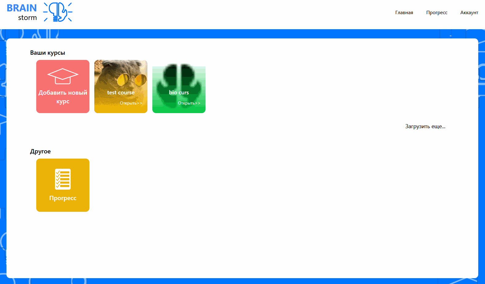
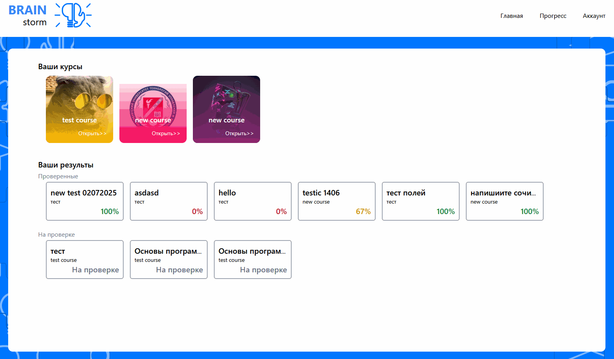
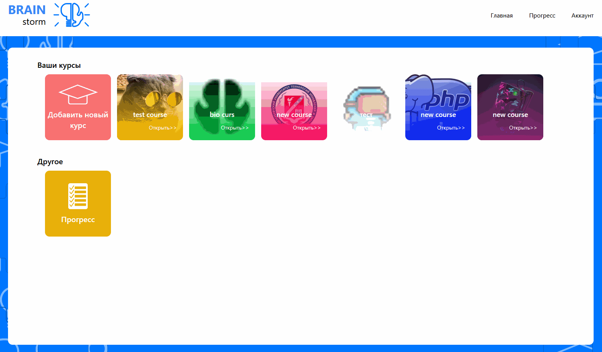
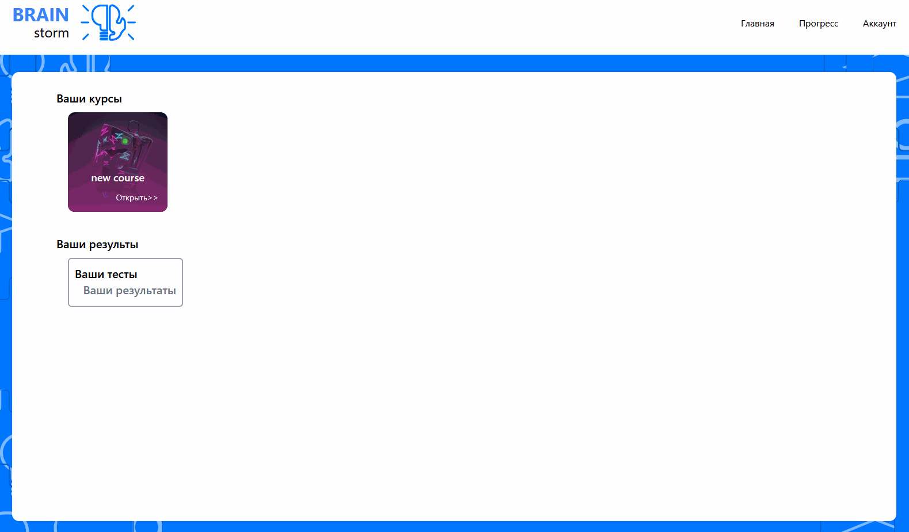
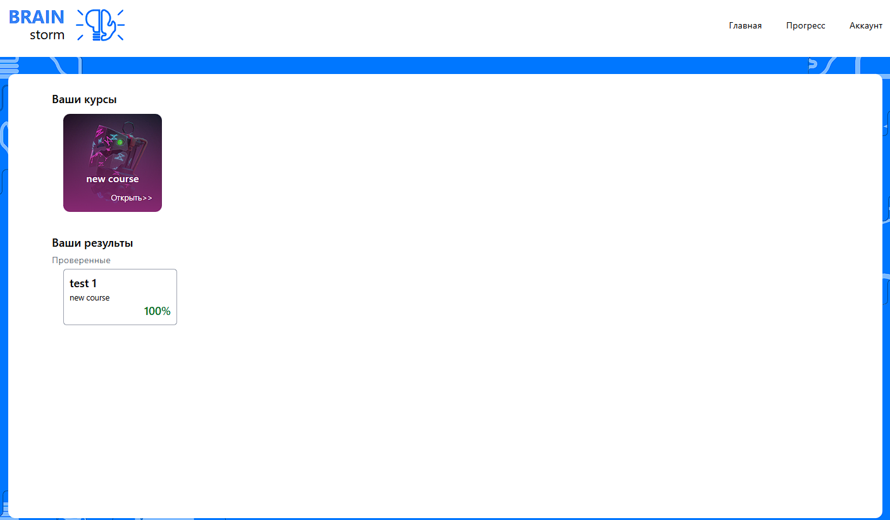

# BrainStorm

**BrainStorm** — это веб-приложение для тестирования студентов по курсам. Преподаватели могут создавать курсы и тесты, а студенты — проходить их и следить за своим прогрессом.

## Основные возможности

**Для преподавателей (Админов):**
* Создание и настройка учебных курсов.
* Разработка тестов с разными типами вопросов: выбор ответа, флажки, текстовые поля.
* Назначение курсов конкретным студентам.
* Проверка тестов с открытыми ответами и ручное выставление оценок.
* Отслеживание прогресса всех студентов.

**Для студентов:**
* Доступ к назначенным курсам и тестам.
* Прохождение тестов с мгновенным результатом (для вопросов с готовыми ответами).
* Просмотр истории и результатов всех пройденных тестов.
* Управление своим профилем (смена имени, email, пароля).

## Создание и настройка курса

Веб-приложение позволяет создавать новые курсы с уникальным внешним видом, тестами и списком студентов.

Чтобы студенты увидели курс, их нужно добавить в список участников через специальное окно.

## Создание и проверка теста

Для каждого курса можно создавать тесты с разными типами вопросов: выбор одного варианта, нескольких, ввод текста или развёрнутый ответ.

Если тест содержит вопросы с открытыми ответами, преподаватель проверяет их вручную и выставляет баллы.

## Личный кабинет студента

Студент видит все доступные ему курсы и тесты. После прохождения теста результат показывается сразу или помечается как "на проверке". За тесты с открытыми ответами оценка появляется после проверки преподавателем.

Преподаватель может скорректировать оценку, если, например, система не распознала правильный ответ из-за опечатки.

Студент всегда может посмотреть свою статистику, все прошлые результаты и отредактировать данные профиля.

## Технологии

* **Laravel 10** — серверная логика сайта.
* **Vue.js** — клиентская часть сайта, SPA-приложение.
* **Tailwind CSS** — стилизация интерфейса.
* **Axios** — работа с асинхронными запросами между клиентской и серверной частью приложения.
* **PostgreSQL/MySQL** — база данных для хранения информации.